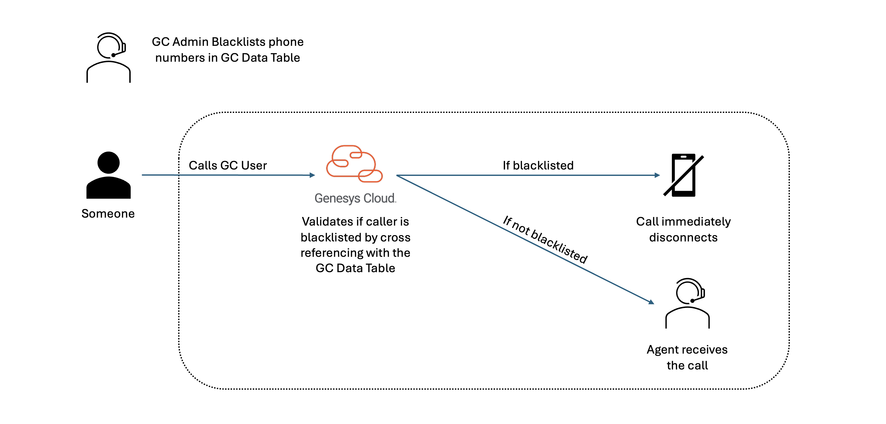

This Genesys Cloud Developer Blueprint explains how MS Teams User Presence can automatically update Genesys Cloud User Presence.

<!--  -->

The following illustration shows the end-to-end user experience that this solution enables.

<!-- ## Solution components

* **Genesys Cloud** - A suite of Genesys cloud services for enterprise-grade communications, collaboration, and contact center management. Contact center agents use the Genesys Cloud user interface.
* **Genesys Cloud API** - A set of RESTful APIs that enables you to extend and customize your Genesys Cloud environment.
* **Data Table** - Provides the ability to save blacklisted phone numbers from inbound calling.
* **Data Action** - Provides the integration point to invoke a third-party REST web service or AWS lambda.
* **Architect flows** - A flow in Architect, a drag and drop web-based design tool, dictates how Genesys Cloud handles inbound or outbound interactions.
* **Triggers** - Provides the ability for a data action and architect workflow to work cohisively to perform the task.

## Prerequisites

### Specialized knowledge

* Administrator-level knowledge of Genesys Cloud
* Expereince with REST API authentication

### Genesys Cloud account

* A Genesys Cloud CX 1 license. For more information, see [Genesys Cloud Pricing](https://www.genesys.com/pricing "Opens the Genesys Cloud pricing article").
* The Master Admin role in Genesys Cloud. For more information, see [Roles and permissions overview](https://help.mypurecloud.com/?p=24360 "Opens the Roles and permissions overview article") in the Genesys Cloud Resource Center.

## Configure Genesys Cloud

### Create a custom role & assign permissions to use with Genesys Cloud OAuth clients

1. Navigate to **Admin** > **Roles/Permissions** and click **Add Role**.
2. Type a **Name** for your custom role. (Example: "Blacklist Callers")
3. Search and select the **Conversation**>**Communication**>**Disconnect** permissions
4. Click **Save** to assign the appropriate permissions to your custom role.

   

## Data Table

### Create a Data Table
1. Go to **Admin**>**Architect**>**Data Table**
2. First you will want to create a data table. Example name can be “Blacklist”. 
2. You will then primarily need to have the Reference Key set as "ani". 
3. Click "Save"

   

### Add your Blacklist Numbers (to block incoming calls)
1. Open your Data Table
2. Press "+" in the top right corner of the screen. 
3. Under the ani header column, you will store all the phone numbers you wish to block from incoming calls or queues.
4. Click "Save" 

   NOTE: The phone numbers need to be formatted using e.164 without the "+", for example; 17705551234. This also allows for CSV import without many formatting issues. More information on this below. 

   

## Data Action

You will need to create a Genesys Cloud data action that will be used for disconnecting interactions. This can be called “Disconnect interaction”. 

### Create an OAuth client for use with a Genesys Cloud data action integration

To enable a Genesys Cloud data action to make public API requests on behalf of your Genesys Cloud organization, use an OAuth client to configure authentication with Genesys Cloud.

Create an OAuth client to use with the data action integration with a custom role.

To create an OAuth Client in Genesys Cloud:

1. Navigate to **Admin** > **Integrations** > **OAuth** and click **Add Client**.

2. Enter the name (Example: Disconnect Interaction) for the OAuth client and select **Client Credentials** as the grant type. Click the **Roles** tab and assign the required role for the OAuth client.

3. Click **Save**. Copy the client ID and the client secret values for later use.

   

   **Note:** Ensure that you **copy the client ID and client secret values** for each of the OAuth clients.

### Add Genesys Cloud data action integration

Add a Genesys cloud data action integration for each OAuth client being used with this blueprint to call the Genesys Cloud public API to:
* Terminate the call of an inbound blacklisted caller

To create a data action integration in Genesys Cloud:

1. Navigate to **Admin** > **Integrations** > **Integrations** and install the **Genesys Cloud Data Actions** integration. For more information, see [About the data actions integrations](https://help.mypurecloud.com/?p=209478 "Opens the About the data actions integrations article") in the Genesys Cloud Resource Center.

2. Enter a name for the Genesys Cloud data action, such as "Disconnect Interaction" in this blueprint solution.

3. On the **Configuration** tab, click **Credentials** and then click **Configure**.

4. Enter the client ID and client secret that you saved for the Public API (OAuth Client 1). Click **OK** and save the data action.

5. Navigate to the Integrations page and set the data action integration to **Active**.

   

### Import the Genesys Cloud data actions

1. Download the `Disconnect-Interaction.json` JSON file from the [ani-blacklist](https://github.com/GenesysCloudBlueprints/ani-blacklist) GitHub repository.
2. In Genesys Cloud, navigate to **Admin** > **Integrations** > **Actions** and click **Import**.
3. Select the `Disconnect-Interaction.json` file and associate with "Disconnect Interaction" data action integration, which uses the Disconnect Interaction Public API OAuth client.
4. click **Import Action**.
5. Click **Save & Publish**

   

## Architect 

### Import the Architect workflows

This solution includes one Architect workflow that uses one [data action](#add-genesys-cloud-data-action-integrations "Goes to the Add a web services data actions integration section"). 

* The **Blacklist.i3WorkFlow** workflow is triggered when a blacklisted caller dials to Genesys Cloud communicate user. This workflow terminates an inbound phone call if it matches the phone number from the Data Table. 

First import this workflow to your Genesys Cloud organization:

1. Download the `Blacklist.i3WorkFlow` file from the [ani-blacklist repo](https://github.com/GenesysCloudBlueprints/ani-blacklist) GitHub repository.

2. In Genesys Cloud, navigate to **Admin** > **Architect** > **Flows:Workflow** and click **Add**.

3. Enter a name for the workflow and click **Create Flow**.

4. From the **Save** menu, click **Import**.

5. Select the downloaded **Blacklist.i3WorkFlow** file and click **Import**.

6. Review your workflow. Click **Save** and then click **Publish**.
   
   

   **Note:** If you imported the `Blacklist.i3WorkFlow` file, your workflow will look like the flow below. 

   

## Triggers

Create the trigger that invokes the created Architect workflow.

1. From Admin Home, search for **Triggers** and navigate to the Triggers list.

2. From the Triggers list, click **Add Trigger**

3. From the Add New Trigger modal, name your trigger and click **Add**

4. From the Trigger single view input **Topic Name**, **Workflow Target**, and **Data Format** as mentioned in the table below.  

| Topic Name | Workflow Target | Data Format |
|---------------------------------------------------|-----------|--------------------|
| v2.detail.events.conversation.{id}.customer.start | Blacklist | TopLevelPrimitives |

5. Click **Add Condition**.  
   NOTE: For more information, see [Available Topics](https://developer.genesys.cloud/notificationsalerts/notifications/available-topics "Opens the Available Topics article") in the Genesys Cloud Developer Center. Using the notification monitoring tool in the Developer Center, you can watch the notifications happen.

6. From the Trigger single view, input **JSON Path**, **Operator**, and **Value** as mentioned in the table below. 

| Topic Name | Workflow Target | Data Format |
|------------|-----------------|-------------|
| mediaType | Equals(==) | VOICE |

7. Click **Save**.

   

### You can now add numbers to the Blacklist Data Table under the ani column header and those callers will be disconnected when they try calling you.  

## Additional resources

* [Genesys Cloud API Explorer](https://developer.genesys.cloud/devapps/api-explorer "Opens the GC API Explorer") in the Genesys Cloud Developer Center
* [Genesys Cloud notification triggers](https://developer.genesys.cloud/notificationsalerts/notifications/available-topics "Opens the Available topics page") in the Genesys Cloud Developer Center
* The [ani-blacklist](https://github.com/GenesysCloudBlueprints/ani-blacklist) repository in GitHub -->
