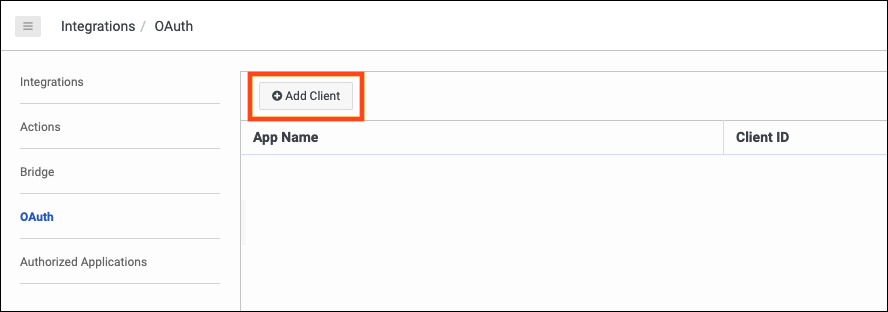
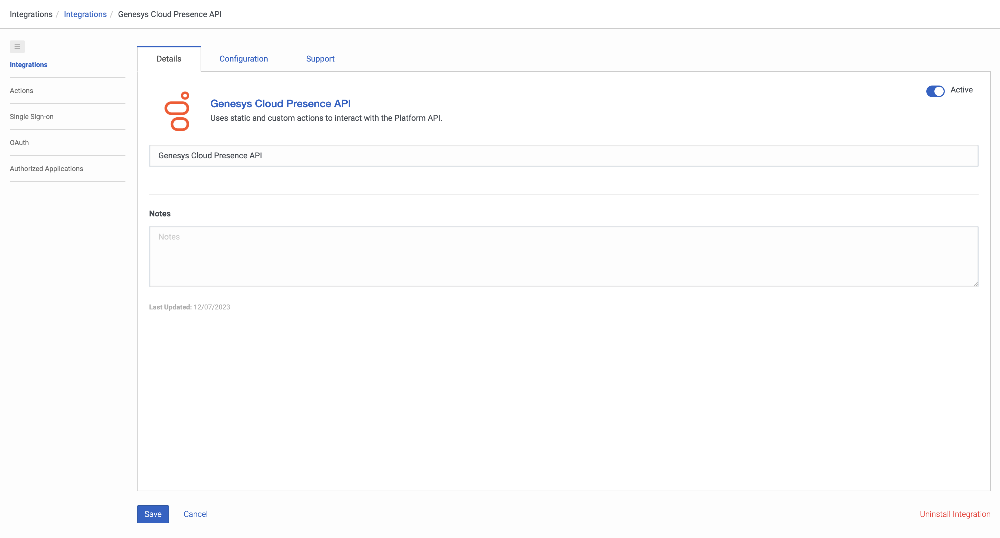

This Genesys Cloud Developer Blueprint describes how to set up Genesys Cloud to update a Genesys Cloud user's presence when the corresponding Microsoft Teams user has a presence change.

The following illustration shows the end-to-end user experience that this solution enables.

## Solution components

* **Genesys Cloud** - A suite of Genesys cloud services for enterprise-grade communications, collaboration, and contact center management. Contact center agents use the Genesys Cloud user interface.
* **Genesys Cloud API** - A set of RESTful APIs that enables you to extend and customize your Genesys Cloud environment.

## Prerequisites

### Specialized knowledge

* Administrator-level knowledge of Genesys Cloud

### Genesys Cloud account

* A Genesys Cloud CX 1 license. For more information, see [Genesys Cloud Pricing](https://www.genesys.com/pricing "Opens the Genesys Cloud pricing article").
* The Master Admin role in Genesys Cloud. For more information, see [Roles and permissions overview](https://help.mypurecloud.com/?p=24360 "Opens the Roles and permissions overview article") in the Genesys Cloud Resource Center.
* The Microsoft Azure Active Directory SCIM integration for Microsoft Teams must be implemented in your Genesys Cloud organization. For more information, see [Configure the Microsoft Teams integration](https://help.mypurecloud.com/?p=222880 "Opens the Configure the Microsoft Teams integration article") in the Genesys Cloud Resource Center.
* GC Users must have their Microsoft Teams account linked to their Genesys Cloud user account.  For more information, see [Use Microsoft Teams in Genesys Cloud](https://help.mypurecloud.com/articles/use-microsoft-teams-in-genesys-cloud/ "Opens the Use Microsoft Teams in Genesys Cloud article") in the Genesys Cloud Resource Center.

## Configure Genesys Cloud

### Create custom roles for use with Genesys Cloud OAuth clients

Create a custom role for use with a Genesys Cloud OAuth client with the following permissions.

| Roles           | Permissions | Role Name |
|-----------------|-------------------------|---------|
| Custom role 1 | **presence** > **All Permissions**  | Presence API User |

To create a custom role in Genesys Cloud:

1. Navigate to **Admin** > **Roles/Permissions** and click **Add Role**.

   

2. Enter the **Name** for your custom role.

    

3. Search and select the required permission for each of the custom role.
   
4. Click **Save** to assign the appropriate permission to your custom role.

:::primary
  **Note:** Assign this custom role to your user before creating the Genesys Cloud OAuth client.
  :::

### Create an OAuth client for use with a Genesys Cloud data action integration

To enable a Genesys Cloud data action to make public API requests on behalf of your Genesys Cloud organization, use an OAuth client to configure authentication with Genesys Cloud.

Create an OAuth client for use with the data action integration with the following custom roles.

| OAuth Client   | Custom role | OAuth Client Name |
|----------------|-------------------------------|-------|
| OAuth Client 1 | Presence API User | Presence Public API |

To create an OAuth Client in Genesys Cloud:

1. Navigate to **Admin** > **Integrations** > **OAuth** and click **Add Client**.

   

2. Enter the name for the OAuth client and select **Client Credentials** as the grant type. Click the **Roles** tab and assign the required role for the OAuth client.

     

3. Click **Save**. Copy the client ID and the client secret values for later use.

   

:::primary
  **Note:** Ensure that you copy the client ID and client secret values for each of the OAuth clients.
  :::

### Add Genesys Cloud data action integration

Add a Genesys Cloud data action integration for each OAuth client being used with this blueprint to call the Genesys Cloud public API to:
* Lookup a Genesys Cloud User's presence
* Update a Genesys Cloud User's presence

To create a data action integration in Genesys Cloud:

1. Navigate to **Admin** > **Integrations** > **Integrations** and install the **Genesys Cloud Data Actions** integration. For more information, see [About the data actions integrations](https://help.mypurecloud.com/?p=209478 "Opens the About the data actions integrations article") in the Genesys Cloud Resource Center.

   

2. Enter a name for the Genesys Cloud data action, such as Update Genesys Cloud User Presence in this blueprint solution.

   

3. On the **Configuration** tab, click **Credentials** and then click **Configure**.

   

4. Enter the client ID and client secret that you saved for the Presence Public API [(OAuth Client 1)](#create-oauth-clients-for-use-with-genesys-cloud-data-action-integrations "Goes to the create an OAuth Client section"). Click **OK** and save the data action.

   

5. Navigate to the Integrations page and set the presence data action integration to **Active**.

   

### Import two Genesys Cloud data actions

The GC User Presence data actions use the authenticated token that is supplied by the presence GC OAuth Client created in the previous step.

1. From the [gc-presence-update-from-ms-teams repo](https://github.com/GenesysCloudBlueprints/gc-presence-update-from-ms-teams) GitHub repository, download the GC-User-Presence-Update.custom.json file.

2. In Genesys Cloud, navigate to **Integrations** > **Actions** and click **Import**.

  

3. Select the GC-User-Presence-Update.custom.json file and associate it with the **Update Genesys Cloud User Presence** integration that you created in the [Add a web services data actions integration](#add-a-web-services-data-actions-integration "Goes to the Add a web services data actions integration section") section, and then click **Import Action**.

  

4. From the [gc-presence-update-from-ms-teams repo](https://github.com/GenesysCloudBlueprints/gc-presence-update-from-ms-teams) GitHub repository, download the Get-Genesys-Cloud-User-Presence.custom.json file.

5. In Genesys Cloud, navigate to **Integrations** > **Actions** and click **Import**.

 

6. Select the Get-Genesys-Cloud-User-Presence.custom.json file and associate it with the **Update Genesys Cloud User Presence** integration that you created in the [Add a web services data actions integration](#add-a-web-services-data-actions-integration "Goes to the Add a web services data actions integration section") section, and then click **Import Action**.

 
