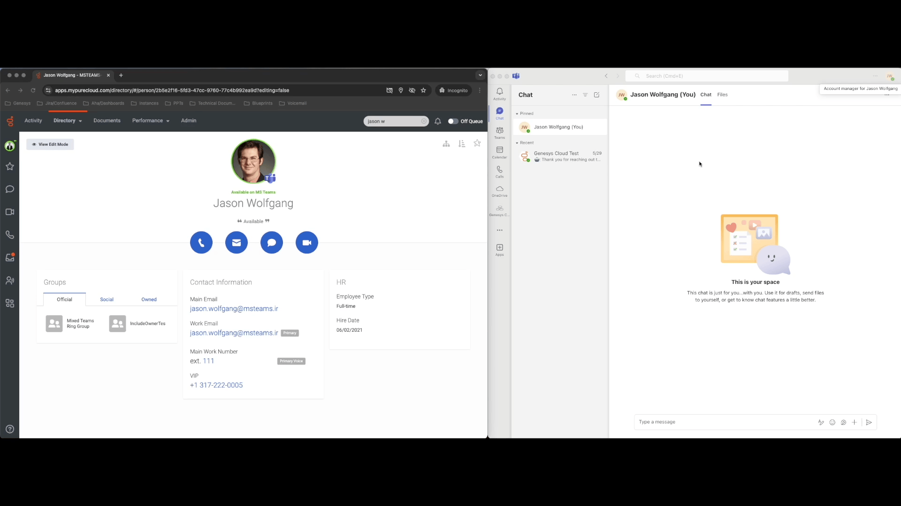
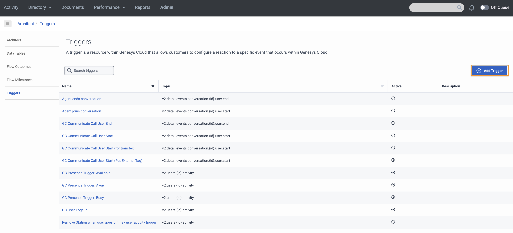

This Genesys Cloud Developer Blueprint describes how to set up Genesys Cloud to update a Genesys Cloud user's presence when the corresponding Microsoft Teams user has a presence change.

The following illustration shows the end-to-end user experience that this solution enables.

## Solution components

* **Genesys Cloud** - A suite of Genesys cloud services for enterprise-grade communications, collaboration, and contact center management. Contact center agents use the Genesys Cloud user interface.
* **Genesys Cloud API** - A set of RESTful APIs that enables you to extend and customize your Genesys Cloud environment.

## Prerequisites

### Specialized knowledge

* Administrator-level knowledge of Genesys Cloud

### Genesys Cloud account

* A Genesys Cloud CX 1 license. For more information, see [Genesys Cloud Pricing](https://www.genesys.com/pricing "Opens the Genesys Cloud pricing article").
* The Master Admin role in Genesys Cloud. For more information, see [Roles and permissions overview](https://help.mypurecloud.com/?p=24360 "Opens the Roles and permissions overview article") in the Genesys Cloud Resource Center.
* The Microsoft Azure Active Directory SCIM integration for Microsoft Teams must be implemented in your Genesys Cloud organization. For more information, see [Configure the Microsoft Teams integration](https://help.mypurecloud.com/?p=222880 "Opens the Configure the Microsoft Teams integration article") in the Genesys Cloud Resource Center.
* GC Users must have their Microsoft Teams account linked to their Genesys Cloud user account.  For more information, see [Use Microsoft Teams in Genesys Cloud](https://help.mypurecloud.com/articles/use-microsoft-teams-in-genesys-cloud/ "Opens the Use Microsoft Teams in Genesys Cloud article") in the Genesys Cloud Resource Center.

## Configure Genesys Cloud

### Create custom roles for use with Genesys Cloud OAuth clients

Create a custom role for use with a Genesys Cloud OAuth client with the following permissions.

| Roles           | Permissions | Role Name |
|-----------------|-------------------------|---------|
| Custom role 1 | **presence** > **All Permissions**  | Presence API User |

To create a custom role in Genesys Cloud:

1. Navigate to **Admin** > **Roles/Permissions** and click **Add Role**.

   

2. Enter the **Name** for your custom role.

    

3. Search and select the required permission for each of the custom role.
   
4. Click **Save** to assign the appropriate permission to your custom role.

:::primary
  **Note:** Assign this custom role to your user before creating the Genesys Cloud OAuth client.
  :::

### Create an OAuth client for use with a Genesys Cloud data action integration

To enable a Genesys Cloud data action to make public API requests on behalf of your Genesys Cloud organization, use an OAuth client to configure authentication with Genesys Cloud.

Create an OAuth client for use with the data action integration with the following custom roles.

| OAuth Client   | Custom role | OAuth Client Name |
|----------------|-------------------------------|-------|
| OAuth Client 1 | Presence API User | Presence Public API |

To create an OAuth Client in Genesys Cloud:

1. Navigate to **Admin** > **Integrations** > **OAuth** and click **Add Client**.

   

2. Enter the name for the OAuth client and select **Client Credentials** as the grant type. Click the **Roles** tab and assign the required role for the OAuth client.

     

3. Click **Save**. Copy the client ID and the client secret values for later use.

   

:::primary
  **Note:** Ensure that you copy the client ID and client secret values for each of the OAuth clients.
  :::

### Add Genesys Cloud data action integration

Add a Genesys Cloud data action integration for the OAuth client being used with this blueprint to call the Genesys Cloud public API to:
* Lookup a Genesys Cloud User's presence
* Update a Genesys Cloud User's presence

To create a data action integration in Genesys Cloud:

1. Navigate to **Admin** > **Integrations** > **Integrations** and install the **Genesys Cloud Data Actions** integration. For more information, see [About the data actions integrations](https://help.mypurecloud.com/?p=209478 "Opens the About the data actions integrations article") in the Genesys Cloud Resource Center.

   

2. Enter a name for the Genesys Cloud data action, such as **Genesys Cloud Presence API** in this blueprint solution.

   

3. On the **Configuration** tab, click **Credentials** and then click **Configure**.

   

4. Enter the client ID and client secret that you saved for the Presence Public API [(OAuth Client 1)](#create-oauth-clients-for-use-with-genesys-cloud-data-action-integrations "Goes to the create an OAuth Client section"). Click **OK** and save the data action.

   

5. Navigate to the Integrations page and set the presence data action integration to **Active**.

   

### Import two Genesys Cloud data actions

The GC User Presence data actions use the authenticated token that is supplied by the presence GC OAuth Client created in the previous step.

1. From the [gc-presence-update-from-ms-teams repo](https://github.com/GenesysCloudBlueprints/gc-presence-update-from-ms-teams) GitHub repository, navigate to the **exports** directory and download the GC-User-Presence-Update.custom.json file.

2. In Genesys Cloud, navigate to **Integrations** > **Actions** and click **Import**.

  

3. Select the GC-User-Presence-Update.custom.json file and associate it with the **Update Genesys Cloud User Presence** integration that you created in the [Add a web services data actions integration](#add-a-web-services-data-actions-integration "Goes to the Add a web services data actions integration section") section, and then click **Import Action**.

  

4. From the [gc-presence-update-from-ms-teams repo](https://github.com/GenesysCloudBlueprints/gc-presence-update-from-ms-teams) GitHub repository, navigate to the **exports** directory and download the Get-Genesys-Cloud-User-Presence.custom.json file.

5. In Genesys Cloud, navigate to **Integrations** > **Actions** and click **Import**.

 

6. Select the Get-Genesys-Cloud-User-Presence.custom.json file and associate it with the **Update Genesys Cloud User Presence** integration that you created in the [Add a web services data actions integration](#add-a-web-services-data-actions-integration "Goes to the Add a web services data actions integration section") section, and then click **Import Action**.

 

## Create a Data Table
1. From the [gc-presence-update-from-ms-teams repo](https://github.com/GenesysCloudBlueprints/gc-presence-update-from-ms-teams) GitHub repository, navigate to the **exports** directory and download the **TeamsPresenceMappings.csv** file.
2. Go to **Admin**>**Architect**>**Data Table**
3. Click **Add**
4. Name your data table **MsTeamsPresenceMappings** and define the **Reference Key Label** as **MsTeamsPresenceMappings**.
 
5. Click "Save"
6. From the Data Table list view, open your newly created **MSTeamsPresenceMappings** Data Table
7. From the Data Table single view, click **Manage Imports**
8. Click **Select Import File**, locate the **TeamsPresenceMappings.csv** file on your machine
9. Select the appropriate **Import Options** mode of **Append Data** or **Replace All Data** based on your use case
10. Click **Import**

  :::primary
  **Note:** Below is a table of the default presence mappings from Microsoft Teams to Genesys Cloud.  Adjust these mappings to suit your business rules.  If there are Microsoft Teams presence values that you do NOT want to trigger a Genesys Cloud presence update, simply remove them from the csv file prior to import.  
  :::

  | Teams Presence   | GC Presence | GC Presence Id |
  |----------------|-------------------------------|-------|
  | Available | Available | 6a3af858-942f-489d-9700-5f9bcdcdae9b |
  | Away | Away | 5e5c5c66-ea97-4e7f-ac41-6424784829f2 |
  | BeRightBack | Away | 5e5c5c66-ea97-4e7f-ac41-6424784829f2 |
  | Busy | Busy | 31fe3bac-dea6-44b7-bed7-47f91660a1a0 |
  | DoNotDisturb | Busy | 31fe3bac-dea6-44b7-bed7-47f91660a1a0 |
  | Focusing | Busy | 31fe3bac-dea6-44b7-bed7-47f91660a1a0 |
  | InACall | Busy | 31fe3bac-dea6-44b7-bed7-47f91660a1a0 |
  | InAMeeting | Busy | 31fe3bac-dea6-44b7-bed7-47f91660a1a0 |
  | Offline | Offline | ccf3c10a-aa2c-4845-8e8d-f59fa48c58e5 |
  | OffWork | Offline | ccf3c10a-aa2c-4845-8e8d-f59fa48c58e5 |
  | Presenting | Busy | 31fe3bac-dea6-44b7-bed7-47f91660a1a0 |

  :::primary
  **Note:** If you have user defined secondary presence values you would like to use in your presence mappings, you can use the **GET /api/v2/presencedefinitions** GC Public API endpoint to find all your presence definition ids.  A link to the Genesys Cloud API explorer is in the Additional Resources section at the bottom of this blueprint.  Once you have the id of the presence value you would like to use, simply update the csv file prior to import.
  :::

### Import the Architect workflow

This solution includes one Architect workflow that uses the data actions you just created to retrieve and update the user's presence in Genesys Cloud.

* The **Microsoft Teams Integration Presence Trigger.i3WorkFlow** workflow is triggered upon a Microsoft Teams integration presence change. This workflow looks up the GC user's current Genesys Cloud presence to ensure they are not "On Queue".  If they are not "On Queue", the Teams Presence value is looked up in a Data Table with mappings to Genesys Cloud Presence Id's.  If the Microsoft Teams presence value is found, the GC user's GC presence will be updated with the Genesys Cloud presence value corresponding to the Microsoft Teams presence value in the data table.

This workflow will be called by the process automation trigger, which you will create in the next section.

1. From the [gc-presence-update-from-ms-teams repo](https://github.com/GenesysCloudBlueprints/gc-presence-update-from-ms-teams) GitHub repository, navigate to the **exports** directory and download the **Microsoft Teams Integration Presence Trigger.i3WorkFlow** file.

2. In Genesys Cloud, navigate to **Admin** > **Architect** > **Flows:Workflow** and click **Add**.

   

3. Name your workflow and click **Create**.

  

4. From the **Save** menu, click **Import**.

   

5. Select the downloaded **Microsoft Teams Integration Presence Trigger.i3WorkFlow** file. Click **Import**.

   

6. After you have reviewed your workflow, click **Save** and then click **Publish**.

  

## Create the trigger

Create the trigger that invokes the created Architect workflow.

1. From Admin Home, search for **Triggers** and navigate to the Triggers list.

 

2. From the Triggers list, click **Add Trigger**

 

3. From the Add New Trigger modal, name your trigger and click **Add**

 

4. From the Trigger single view, in the **Topic Name** menu, select **v2.users.{id}.integrationpresence**.  In the **Workflow Target** menu, select **Microsoft Teams Integration Presence Trigger**.  Leave **Data Format** as **TopLevelPrimitives**.  Click **Add Condition**.  For more information, see [Available Topics](https://developer.genesys.cloud/notificationsalerts/notifications/available-topics "Opens the Available Topics article") in the Genesys Cloud Developer Center.  Using the notification monitoring tool in the Developer Center, you can watch the notifications happen.

5. From the Trigger single view, in the **JSON Path** field, type **source**.  In the **Operator** menu, select **Equals (==)**.  In the **Value** field, type **"MICROSOFTTEAMS"**.  Click **Create**.

    

6. From the Trigger single view, set the **Active** toggle to **Active**.  Click **Save**.

   

## Additional resources

* [Genesys Cloud API Explorer](https://developer.genesys.cloud/devapps/api-explorer "Opens the GC API Explorer") in the Genesys Cloud Developer Center
* [Genesys Cloud notification triggers](https://developer.genesys.cloud/notificationsalerts/notifications/available-topics "Opens the Available topics page") in the Genesys Cloud Developer Center
* The [gc-presence-update-from-ms-teams repo](https://github.com/GenesysCloudBlueprints/gc-presence-update-from-ms-teams) repository in GitHub
