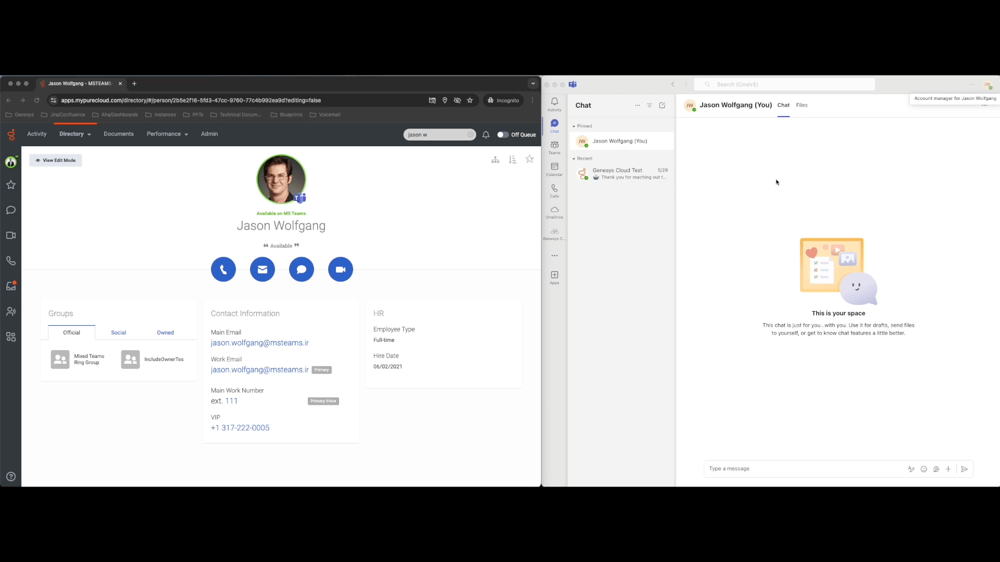

# Update the presence of a Genesys Cloud User from Microsoft Teams User Presence Update

This Genesys Cloud Developer Blueprint describes how to set up Genesys Cloud to update a Genesys Cloud user's presence when the corresponding Microsoft Teams user has a presence change.

The following illustration shows the end-to-end user experience that this solution enables.

